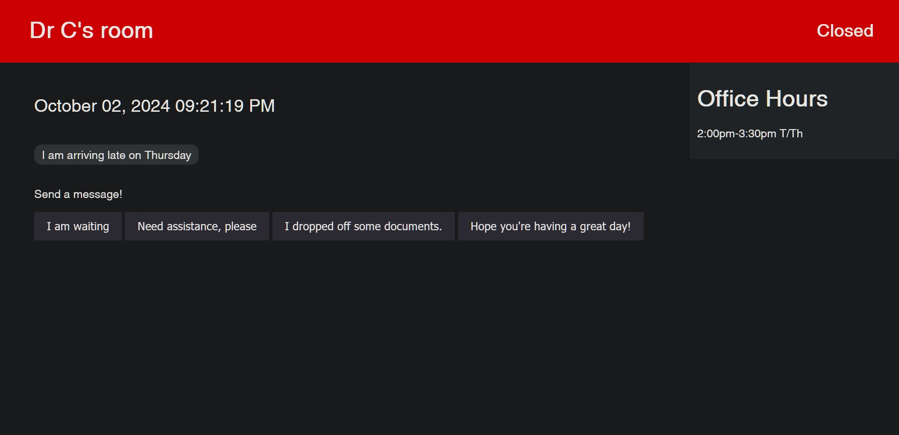

# Digital Door Sign System with ESP32-CAM Integration

## Overview

This project is a dynamic office management solution built with Flask, featuring real-time status updates, optional ESP32-CAM integration for enhanced visitor monitoring, displaying videos on the display, and a function to help visitors to navigate office buildings.

- **Communicate information to visitors on the webpage**

- **Customizable QR Code to allow visitors to send an email to you**
  
- **Be notified when someone uses the webpage by detecting taps and then sending an email containing an image of the detected user**



## Features

### Web Interface

- **Live Dashboard**: Displays current room status, name, and office hours
- **Management Portal**: Update office information and post messages
- **Real-time Updates**: Automatic refresh of displayed information

### API Endpoints

- `/`: Renders the main index page with current room information
- `/navigate`: Handles navigation requests and redirects to route display
- `/display_route`: Displays the navigation route image
- `/take_picture`: Triggers the ESP32 to take a picture
- `/mgmt`: Manages room settings and messages
- `/media`: Renders the media page
- `/update_status`: Cycle through room statuses (Open, Closed, Busy)
- `/send_message`: Post new messages
- `/get_messages`: Retrieve all messages
- `/clear_messages`: Remove all posted messages
- `/updates`: Fetch current office data in JSON format

### ESP32-CAM Integration (Optional)

- Capture images on trigger
- Send email notifications with attached photos
- LED flash for visual feedback

## Setup

### Flask Application

1. Clone the repository

2. Install dependencies:

Arduino:
- Arduino IDE for uploading esp32-cam code
- ESP32 MailClient library
- ESP32 WiFi library

Python:
- OpenCV (cv2): For image processing and drawing3.
- NumPy (numpy): For numerical operations and array handling3.
- PyMuPDF (fitz): For PDF parsing and text extraction3.
- pdf2image: For converting PDF pages to images3.
- Pillow: Required by pdf2image for image processing

You can install these python dependencies using ```pip install opencv-python numpy PyMuPDF pdf2image Pillow```

## Usage
Open the terminal and navigate to the main directory of the program containing the `app.py` file
Run the Flask app using ```python app.py```
- Access the main dashboard at `http://localhost:5000`, or the provided address when running 'python app.py'
- Use the management interface at `http://localhost:5000/mgmt`
- Refer to the API endpoints listed above, or check app.py for a complete list.

### Configure QR Code

1. Upload your own qrcode by placing qrcode.png into ```/static/ directory```

### ESP32-CAM 

1. Update Wi-Fi credentials in the ESP32 code
2. Configure email settings (SMTP server, sender, recipient)
3. Flash the code to your ESP32-CAM module

### Navigation feature
Make sure to set your current room within the ```process_naviation``` file
The ```process_naviation``` algorithm is based off the following assumptions about input pdf files:
1. 3-digit room numbers, with an optional letter before or after (123, A123, 123A)
2. Staircase room names begin with the letter Z
3. All relevant PDFs are in a directory named "maps"
Command line usage: ```Usage: python process_navigation.py <destination_room>```