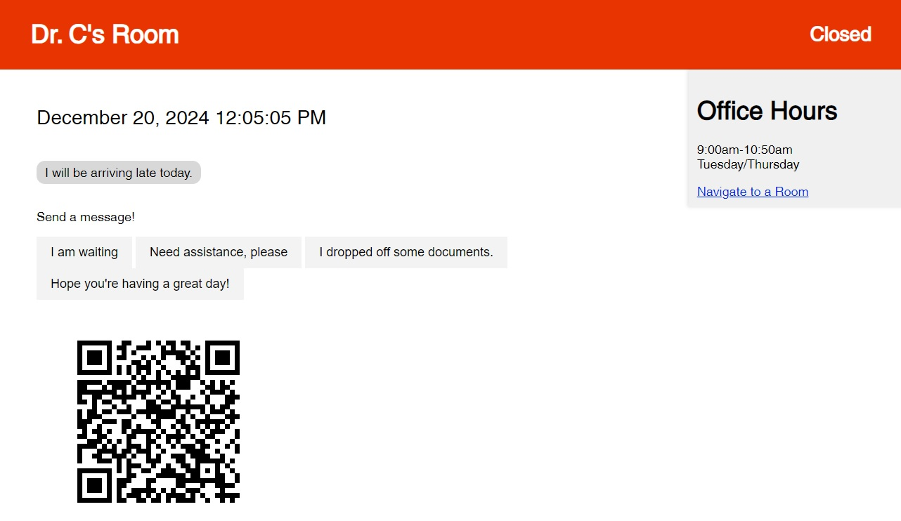

# Digital Door Sign System with ESP32-CAM Integration

## Overview

This project is a dynamic office management solution built with Flask, featuring real-time status updates and optional ESP32-CAM integration for enhanced visitor monitoring.

- **Communicate information to visitors on the webpage**

- **Customizable QR Code to allow visitors to send an email to you**:
  
- **Be notified when someone uses the webpage by detecting taps and then sending an email containing an image of the detected user**

## Features

### Web Interface

- **Live Dashboard**: Displays current room status, name, and office hours
- **Management Portal**: Update office information and post messages
- **Real-time Updates**: Automatic refresh of displayed information

### API Endpoints

- `/update_status`: Cycle through room statuses (Open, Closed, Busy)
- `/send_message`: Post new messages
- `/get_messages`: Retrieve all messages
- `/clear_messages`: Remove all posted messages
- `/updates`: Fetch current office data in JSON format

### ESP32-CAM Integration (Optional)

- Capture images on trigger
- Send email notifications with attached photos
- LED flash for visual feedback

## Setup

### Flask Application

1. Clone the repository:

2. Install dependencies:

- Arduino IDE for uploading esp32-cam code
- ESP32 MailClient library
- ESP32 WiFi library

3. Run the Flask app:

python app.py

### Configure QR Code**

1. Upload your own qrcode by placing qrcode.png into /static/ directory

### ESP32-CAM (Optional)

1. Update Wi-Fi credentials in the ESP32 code
2. Configure email settings (SMTP server, sender, recipient)
3. Flash the code to your ESP32-CAM module

## Usage

- Access the main dashboard at `http://localhost:5000`, or the provided address when running 'python app.py'
- Use the management interface at `http://localhost:5000/mgmt`
